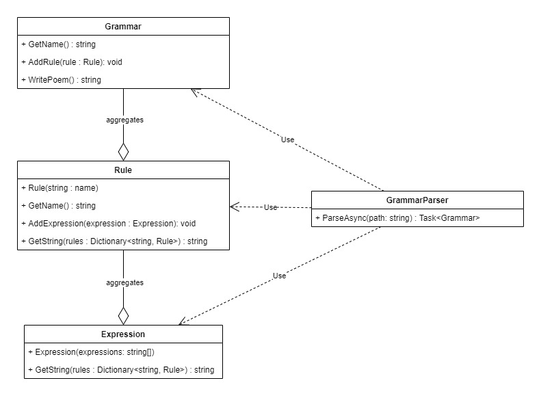

# ArchPoetry
This is a code sample for Arch Insurance. This [PDF](./docs/definition.pdf) goes over the specific details of the problem.

## 1. Create a class diagram which can be used to describe all the different elements of the grammatical rules and their relationships.

Effectively a Grammar consists of an arbitrary number of Rules and a Rule consists of 1 or more Expressions. In more complex grammars, I am sure there would be different types of Expressions. However for this task, I felt like I was able to clearnly cover all of the logic with only one type of Expression.



## 2. Using the design you created for question 1, write a program which first parses the grammatical rules from a text file into your data structure and then uses the data to generate a random poem.

An example of the working program can be obtained by cloning this project onto a machine with .NET Core 2.1 installed and running the following command in the root of the project folder.

```
> dotnet run -- example-grammar.txt
```

Here are examples of some output.

```
outside rain
meadow with flavor flows around thunder
sea
pasture
underneath water across black moon beneath brother
```

```
her white murky
your mother climbs
her sea beyond black flower across mother descends
moon beside your white time outside my harvest flies through clear thunder
moon under flavor
```

## 3. Upon completion, explain how (at a high level) you might adapt this program to generate a haiku (in 2 – 3 sentences).

You would need to create a new type of Expression by refactoring this part of the design into a new interface or subclassing it. This new Expression type would be more aware of the number of syllables it was trying to return rather than the number of words. This type of expression would also use different line termination logic.

I think that it may also require some new grammar as well to key the parser to select this type of expression appropriately when parsing the text file.

## 4. Given the choice between writing ideal code and meeting a critical deadline, which would you choose and why? Explain what changes you might be willing to compromise on

I think that high performing teams manage their own commitments in a way that does not necessitate chosing between maintaining their internal quality standards and hitting their committed deadlines. In general when I see issues of this nature arise, there is an organizational issue. For example, the team may not be tracking the right performance metrics to know what types of commitments that it can sustainably commit to.

In general, the right thing to do when you are trapped in this situation is to start a conversation with the customer as early as possible. Rather than delivering 3 incomplete features riddled with technical debt, it is often better deliver 2 features at the existing quality standard. Most reasonable customers will respond well to this type of conversation. Especially if it is not a recurring type of thing.

If you absolutely must take on technical debt, I like to surface it into the more superficial layers of the application. Technical debt in the UI is better than in the core application. Likewise application services can generally be mocked up easier than databases and may be good candidates to push out. So take technical debt in that general order. Avoid building application logic on incomplete data models at all costs. This can often be impossible to repair later. Especially after functionality is demonstrated on the debt ridden data model.
